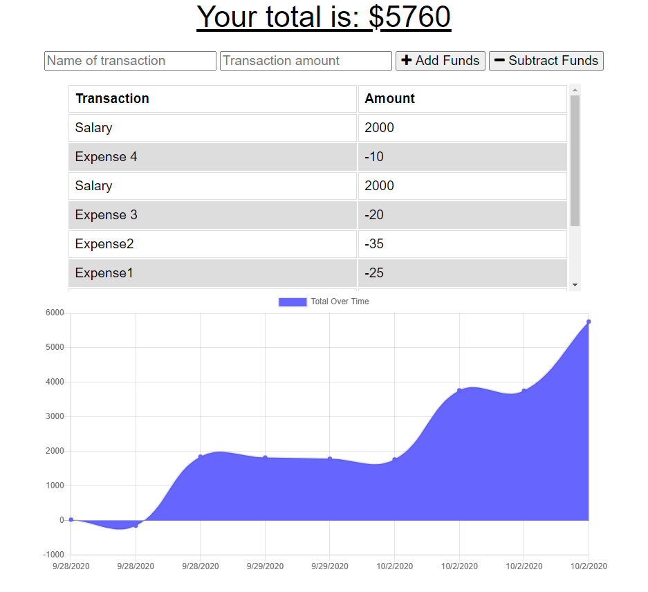

# Progressive Budget

[](https://opensource.org/licenses/MIT)

Link to deployed app: https://secret-badlands-83725.herokuapp.com/



## Description

Giving users a fast and easy way to track their money is important, but allowing them to access that information anytime is even more important. Having offline functionality is paramount to our applications success.

## Table of Contents

* [Installation](#installation)

* [Usage](#usage)

* [License](#license)

* [Contributing](#contributing)

* [Tests](#tests)

* [Questions](#questions)

## Installation

To install necessary dependencies, run the following command:

```
npm express, lite-server, mongoose, morgan & compression
```

## Usage
AS AN avid traveller
I WANT to be able to track my withdrawals and deposits with or without a data/internet connection
SO THAT my account balance is accurate when I am traveling

GIVEN a user is on Budget App without an internet connection 
THEN that will be shown on the page, and added to their transaction history when their connection is back online.

## License

This project is licensed under the MIT license

## Contributing

Not accepting

## Tests

To run tests, run the following command:

```
N/A
```

## Questions

If you have any question about the repo, open an issue or contact me directly at patrick.j.mulhern1@gmail.com. You can find more of my work at pmulhern(https://github.com/pmulhern/).